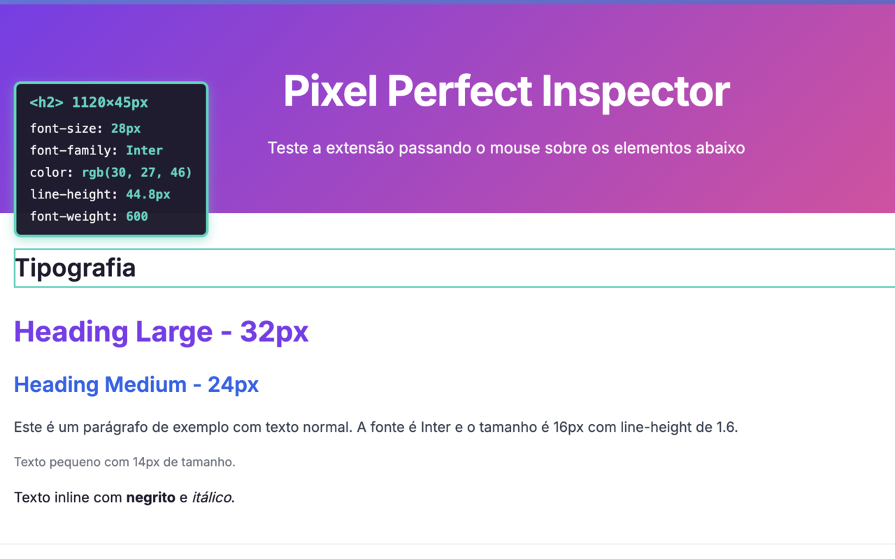
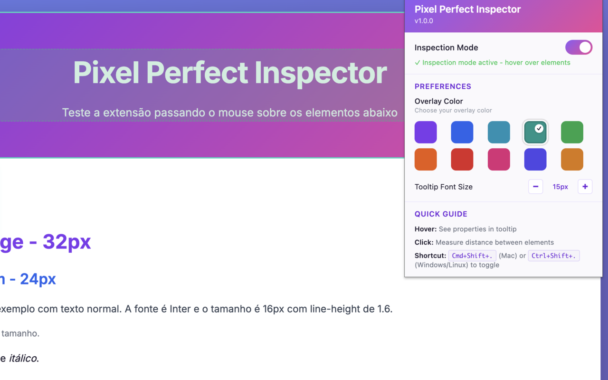
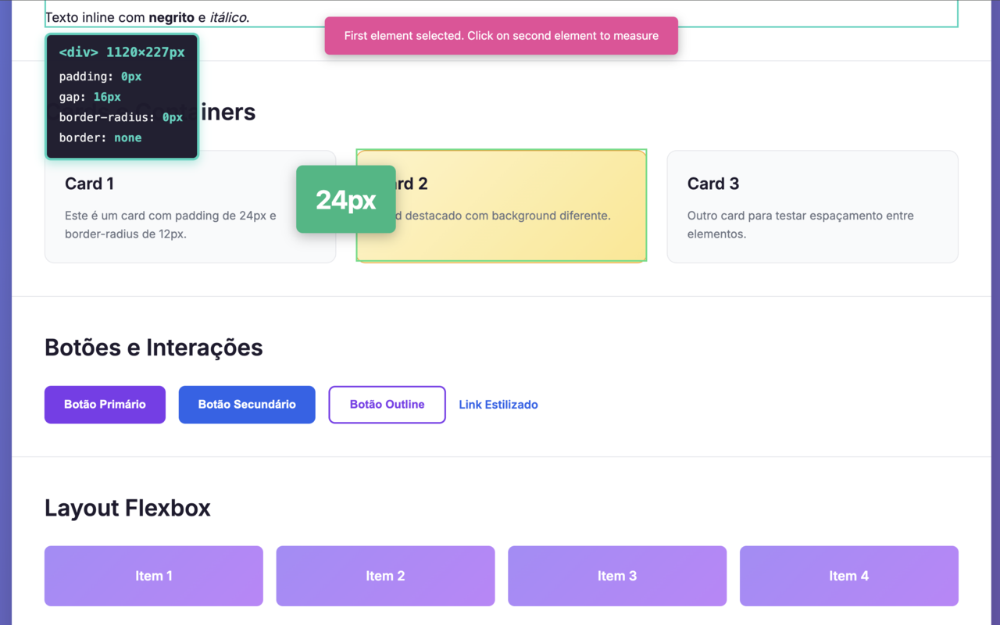

# Pixel Perfect Inspector

<div align="center">


**Inspect and extract CSS properties from DOM elements with pixel-perfect precision**

[English](#english) | [Português](#português)

</div>

---

## English

### Overview

A Chrome extension for inspecting and extracting CSS properties from DOM elements with pixel-perfect precision. Perfect for developers ensuring accurate design implementations, designers checking spacing and typography, and anyone learning CSS.

### System Requirements

- **Browser:** Google Chrome 88+ or Chromium-based browsers (Edge, Brave, Opera)
- **Operating System:** Windows 10+, macOS 10.13+, or Linux
- **Disk Space:** ~5MB
- **Permissions:** Active tab access and local storage

### Features

- **Hover Highlighting** - Visual overlay shows element boundaries and dimensions
- **Smart Tooltips** - Context-aware tooltips show typography for text, layout for containers, and detailed info for images/SVGs
- **Distance Measurement** - Measure distance between any two elements (horizontal, vertical, diagonal)
- **One-Click Property Copying** - Copy individual CSS properties instantly
- **Export Options** - Download complete CSS or JSON data
- **Inspection History** - Quick access to last 10 inspected elements
- **Keyboard Shortcuts** - Efficient workflow with hotkeys
- **Comprehensive Property Extraction** - Typography, spacing, dimensions, borders, and layout
- **Customizable Themes** - Choose from 5 color themes (Purple-Pink, Blue, Green, Orange, Red)
- **Adjustable Font Size** - Tooltip font size from 10-20px
- **Privacy First** - Works entirely locally, no data collection

### Screenshots

#### Extension Popup

*Extension popup showing inspection mode toggle, color theme preferences (Purple→Pink), font size controls (12px), and quick guide.*

#### Tooltip in Action

*Smart tooltip showing typography properties (font-size: 16px, font-family: Inter, color: white, line-height: 28px, font-weight: 400) for a paragraph element on MDN Web Docs.*

#### Distance Measurement

*Measure distance between any two elements with pixel-perfect precision. Shows the exact distance value in a clean, large format.*

### Installation

#### From Chrome Web Store (Recommended)

1. Visit the [Chrome Web Store listing](#) (coming soon)
2. Click "Add to Chrome"
3. Confirm installation

#### From Source (Development)

```bash
# Clone the repository
git clone https://github.com/devrubinho/pixel-perfect-chrome-extension.git
cd pixel-perfect-chrome-extension

# Install dependencies
npm install

# Build the extension
npm run build

# Load in Chrome
# 1. Open Chrome and go to chrome://extensions/
# 2. Enable "Developer mode" (top-right toggle)
# 3. Click "Load unpacked"
# 4. Select the `dist` folder from the project
```

### Usage

#### Quick Start

1. **Activate Inspection Mode**
   - Click the extension icon in the toolbar, OR
   - Use keyboard shortcut: `Ctrl+Shift+P` (Mac: `Cmd+Shift+P`)

2. **Inspect Elements**
   - **Hover** over any element to see its dimensions and properties in a tooltip
   - **Click** to measure distance between two elements (H/V/Diagonal)
   - **Alt+Click** (Option+Click on Mac) to open the detailed property panel

3. **Copy & Export**
   - Click the 📋 icon next to any property to copy it
   - Use "Copy All Properties" to copy entire CSS block
   - Export as JSON or CSS file for documentation

4. **Customize**
   - Open the extension popup to change color themes
   - Adjust tooltip font size (10-20px)
   - Preferences are saved automatically

5. **Access History**
   - Click the extension icon to view recent inspections
   - Click any history item to re-open that element's panel

#### Keyboard Shortcuts

- `Ctrl+Shift+P` (Mac: `Cmd+Shift+P`) - Toggle inspection mode
- `Esc` - Exit inspection mode

**Note:** `Cmd+Shift+I` on Mac opens Chrome DevTools, so we use `Cmd+Shift+P` instead

#### Command Flags (Development)

```bash
npm install        # Install dependencies
npm run build      # Production build
npm run dev        # Development mode
npm run test:page  # Run test server
npm run package    # Package extension for distribution
```

### Use Cases

#### For Developers
- Verify design implementations match specifications
- Extract exact spacing, typography, and layout values
- Debug layout issues by inspecting computed properties
- Document component styles for style guides

#### For Designers
- Check if developers implemented designs accurately
- Extract CSS values from existing websites for inspiration
- Verify responsive design breakpoints
- Analyze competitor website styles

#### For Learners
- Understand how CSS properties work together
- Learn from well-designed websites
- Experiment with different property combinations
- Study real-world CSS implementations

### Extracted Properties

#### Typography
- Font Family
- Font Size
- Font Weight
- Line Height
- Color
- Letter Spacing
- Text Transform

#### Dimensions
- Width (with computed value)
- Height (with computed value)
- Min/Max Width
- Min/Max Height

#### Spacing
- Padding (all sides, with shorthand)
- Margin (all sides, with shorthand)
- Gap (for flexbox/grid)

#### Borders
- Border Radius (all corners)
- Border Width, Style, Color

#### Layout
- Display
- Position
- Flex Direction
- Justify Content
- Align Items

### Development

#### Project Structure

```
pixel-perfect-chrome-extension/
├── src/
│   ├── background/          # Service worker
│   ├── content/            # Content scripts
│   │   ├── inspector.ts    # Main inspector logic
│   │   ├── extractor.ts    # CSS property extraction
│   │   └── overlay.ts      # Visual overlay
│   ├── panel/              # Side panel UI
│   ├── popup/              # Extension popup
│   └── shared/             # Shared utilities
│       ├── types.ts        # TypeScript types
│       ├── clipboard.ts    # Clipboard management
│       └── exporters.ts    # Export functionality
├── public/                 # Static assets
└── dist/                   # Built extension (generated)
```

#### Tech Stack

- **TypeScript 5+** - Type-safe development
- **Chrome Extension Manifest V3** - Latest extension platform
- **Vite** - Fast build tool
- **Vanilla JS** - No framework dependencies for minimal bundle size

#### Building for Production

```bash
# Build optimized version
npm run build

# The dist/ folder contains the production-ready extension
# Test it by loading in Chrome before publishing
```

### Privacy & Permissions

#### Permissions Used

- `activeTab` - Access current tab to inject inspector (only when activated)
- `storage` - Save inspection history locally

#### Privacy Guarantee

- No data is sent to external servers
- No analytics or tracking
- History stored only in your browser
- Works completely offline
- Only activates when you explicitly enable it

### Troubleshooting

#### Extension Icon Not Appearing

- Ensure the extension is enabled in `chrome://extensions/`
- Pin the extension to the toolbar via the extensions menu

#### Inspection Mode Not Working

- Refresh the page after installing/updating the extension
- Check that you've granted necessary permissions
- Try on a different website (some sites may block extensions)

#### Properties Not Displaying Correctly

- Ensure elements have computed styles
- Some properties may not apply to certain elements
- Pseudo-elements are not currently supported

#### Copy/Export Not Working

- Grant clipboard permissions if prompted
- Check browser console for errors
- Ensure popup blockers aren't blocking downloads

### Contributing

Contributions are welcome! Please feel free to submit issues or pull requests.

#### Development Setup

1. Fork the repository
2. Create a feature branch: `git checkout -b feature/my-feature`
3. Make your changes
4. Test thoroughly
5. Commit: `git commit -m "Add my feature"`
6. Push: `git push origin feature/my-feature`
7. Create a Pull Request

### License

MIT License - see [LICENSE](LICENSE) file for details

### Support

- [Report a Bug](https://github.com/devrubinho/pixel-perfect-chrome-extension/issues)
- [Request a Feature](https://github.com/devrubinho/pixel-perfect-chrome-extension/issues)

---

## Português

### Visão Geral

Uma extensão do Chrome para inspecionar e extrair propriedades CSS de elementos DOM com precisão pixel-perfect. Perfeita para desenvolvedores garantindo implementações precisas de design, designers verificando espaçamento e tipografia, e qualquer pessoa aprendendo CSS.

### Requisitos do Sistema

- **Navegador:** Google Chrome 88+ ou navegadores baseados em Chromium (Edge, Brave, Opera)
- **Sistema Operacional:** Windows 10+, macOS 10.13+, ou Linux
- **Espaço em Disco:** ~5MB
- **Permissões:** Acesso à aba ativa e armazenamento local

### Recursos

- **Destacar ao Passar o Mouse** - Sobreposição visual mostra limites e dimensões dos elementos
- **Tooltips Inteligentes** - Tooltips sensíveis ao contexto mostram tipografia para texto, layout para containers e informações detalhadas para imagens/SVGs
- **Medição de Distância** - Medir distância entre quaisquer dois elementos (horizontal, vertical, diagonal)
- **Copiar Propriedades com Um Clique** - Copiar propriedades CSS individuais instantaneamente
- **Opções de Exportação** - Baixar CSS completo ou dados JSON
- **Histórico de Inspeção** - Acesso rápido aos últimos 10 elementos inspecionados
- **Atalhos de Teclado** - Fluxo de trabalho eficiente com teclas de atalho
- **Extração Abrangente de Propriedades** - Tipografia, espaçamento, dimensões, bordas e layout
- **Temas Personalizáveis** - Escolha entre 5 temas de cores (Roxo-Rosa, Azul, Verde, Laranja, Vermelho)
- **Tamanho de Fonte Ajustável** - Tamanho da fonte do tooltip de 10-20px
- **Privacidade em Primeiro Lugar** - Funciona inteiramente localmente, sem coleta de dados

### Capturas de Tela

#### Popup da Extensão

*Popup da extensão mostrando alternância do modo de inspeção, preferências de tema de cores (Roxo→Rosa), controles de tamanho de fonte (12px) e guia rápido.*

#### Tooltip em Ação

*Tooltip inteligente mostrando propriedades de tipografia (font-size: 16px, font-family: Inter, color: white, line-height: 28px, font-weight: 400) para um elemento de parágrafo no MDN Web Docs.*

#### Medição de Distância

*Meça a distância entre quaisquer dois elementos com precisão pixel-perfect. Mostra o valor exato da distância em um formato limpo e grande.*

### Instalação

#### Da Chrome Web Store (Recomendado)

1. Visite a [listagem na Chrome Web Store](#) (em breve)
2. Clique em "Usar no Chrome"
3. Confirme a instalação

#### Do Código Fonte (Desenvolvimento)

```bash
# Clone o repositório
git clone https://github.com/devrubinho/pixel-perfect-chrome-extension.git
cd pixel-perfect-chrome-extension

# Instale as dependências
npm install

# Compile a extensão
npm run build

# Carregue no Chrome
# 1. Abra o Chrome e vá para chrome://extensions/
# 2. Ative o "Modo do desenvolvedor" (alternância no canto superior direito)
# 3. Clique em "Carregar sem compactação"
# 4. Selecione a pasta `dist` do projeto
```

### Uso

#### Início Rápido

1. **Ativar Modo de Inspeção**
   - Clique no ícone da extensão na barra de ferramentas, OU
   - Use o atalho de teclado: `Ctrl+Shift+P` (Mac: `Cmd+Shift+P`)

2. **Inspecionar Elementos**
   - **Passe o mouse** sobre qualquer elemento para ver suas dimensões e propriedades em um tooltip
   - **Clique** para medir a distância entre dois elementos (H/V/Diagonal)
   - **Alt+Clique** (Option+Clique no Mac) para abrir o painel de propriedades detalhado

3. **Copiar e Exportar**
   - Clique no ícone 📋 ao lado de qualquer propriedade para copiá-la
   - Use "Copiar Todas as Propriedades" para copiar o bloco CSS completo
   - Exporte como arquivo JSON ou CSS para documentação

4. **Personalizar**
   - Abra o popup da extensão para alterar os temas de cores
   - Ajuste o tamanho da fonte do tooltip (10-20px)
   - As preferências são salvas automaticamente

5. **Acessar Histórico**
   - Clique no ícone da extensão para visualizar inspeções recentes
   - Clique em qualquer item do histórico para reabrir o painel daquele elemento

#### Atalhos de Teclado

- `Ctrl+Shift+P` (Mac: `Cmd+Shift+P`) - Alternar modo de inspeção
- `Esc` - Sair do modo de inspeção

**Nota:** `Cmd+Shift+I` no Mac abre o Chrome DevTools, então usamos `Cmd+Shift+P` em vez disso

#### Comandos (Desenvolvimento)

```bash
npm install        # Instalar dependências
npm run build      # Compilação de produção
npm run dev        # Modo de desenvolvimento
npm run test:page  # Executar servidor de teste
npm run package    # Empacotar extensão para distribuição
```

### Casos de Uso

#### Para Desenvolvedores
- Verificar se as implementações de design correspondem às especificações
- Extrair valores exatos de espaçamento, tipografia e layout
- Depurar problemas de layout inspecionando propriedades computadas
- Documentar estilos de componentes para guias de estilo

#### Para Designers
- Verificar se os desenvolvedores implementaram os designs com precisão
- Extrair valores CSS de sites existentes para inspiração
- Verificar breakpoints de design responsivo
- Analisar estilos de sites concorrentes

#### Para Estudantes
- Entender como as propriedades CSS funcionam juntas
- Aprender com sites bem projetados
- Experimentar com diferentes combinações de propriedades
- Estudar implementações CSS do mundo real

### Propriedades Extraídas

#### Tipografia
- Família da Fonte
- Tamanho da Fonte
- Peso da Fonte
- Altura da Linha
- Cor
- Espaçamento entre Letras
- Transformação de Texto

#### Dimensões
- Largura (com valor computado)
- Altura (com valor computado)
- Largura Mín/Máx
- Altura Mín/Máx

#### Espaçamento
- Padding (todos os lados, com forma abreviada)
- Margin (todos os lados, com forma abreviada)
- Gap (para flexbox/grid)

#### Bordas
- Border Radius (todos os cantos)
- Largura, Estilo e Cor da Borda

#### Layout
- Display
- Position
- Flex Direction
- Justify Content
- Align Items

### Desenvolvimento

#### Estrutura do Projeto

```
pixel-perfect-chrome-extension/
├── src/
│   ├── background/          # Service worker
│   ├── content/            # Scripts de conteúdo
│   │   ├── inspector.ts    # Lógica principal do inspetor
│   │   ├── extractor.ts    # Extração de propriedades CSS
│   │   └── overlay.ts      # Sobreposição visual
│   ├── panel/              # Interface do painel lateral
│   ├── popup/              # Popup da extensão
│   └── shared/             # Utilitários compartilhados
│       ├── types.ts        # Tipos TypeScript
│       ├── clipboard.ts    # Gerenciamento da área de transferência
│       └── exporters.ts    # Funcionalidade de exportação
├── public/                 # Recursos estáticos
└── dist/                   # Extensão compilada (gerada)
```

#### Stack Tecnológico

- **TypeScript 5+** - Desenvolvimento type-safe
- **Chrome Extension Manifest V3** - Plataforma de extensão mais recente
- **Vite** - Ferramenta de build rápida
- **Vanilla JS** - Sem dependências de framework para tamanho mínimo do bundle

#### Compilando para Produção

```bash
# Compilar versão otimizada
npm run build

# A pasta dist/ contém a extensão pronta para produção
# Teste-a carregando no Chrome antes de publicar
```

### Privacidade e Permissões

#### Permissões Usadas

- `activeTab` - Acesso à aba atual para injetar o inspetor (somente quando ativado)
- `storage` - Salvar histórico de inspeção localmente

#### Garantia de Privacidade

- Nenhum dado é enviado para servidores externos
- Sem análises ou rastreamento
- Histórico armazenado apenas no seu navegador
- Funciona completamente offline
- Só é ativado quando você o habilita explicitamente

### Solução de Problemas

#### Ícone da Extensão Não Aparece

- Certifique-se de que a extensão está habilitada em `chrome://extensions/`
- Fixe a extensão na barra de ferramentas através do menu de extensões

#### Modo de Inspeção Não Funciona

- Atualize a página após instalar/atualizar a extensão
- Verifique se você concedeu as permissões necessárias
- Tente em um site diferente (alguns sites podem bloquear extensões)

#### Propriedades Não Exibem Corretamente

- Certifique-se de que os elementos têm estilos computados
- Algumas propriedades podem não se aplicar a certos elementos
- Pseudo-elementos não são suportados atualmente

#### Copiar/Exportar Não Funciona

- Conceda permissões da área de transferência se solicitado
- Verifique o console do navegador para erros
- Certifique-se de que bloqueadores de popup não estão bloqueando downloads

### Contribuindo

Contribuições são bem-vindas! Sinta-se à vontade para enviar issues ou pull requests.

#### Configuração de Desenvolvimento

1. Faça um fork do repositório
2. Crie uma branch de feature: `git checkout -b feature/minha-feature`
3. Faça suas alterações
4. Teste completamente
5. Commit: `git commit -m "Adicionar minha feature"`
6. Push: `git push origin feature/minha-feature`
7. Crie um Pull Request

### Licença

Licença MIT - veja o arquivo [LICENSE](LICENSE) para detalhes

### Suporte

- [Reportar um Bug](https://github.com/devrubinho/pixel-perfect-chrome-extension/issues)
- [Solicitar uma Feature](https://github.com/devrubinho/pixel-perfect-chrome-extension/issues)

---

<div align="center">

Made with ❤️ for the web development community

[Report Bug](https://github.com/devrubinho/pixel-perfect-chrome-extension/issues) • [Request Feature](https://github.com/devrubinho/pixel-perfect-chrome-extension/issues)

</div>
